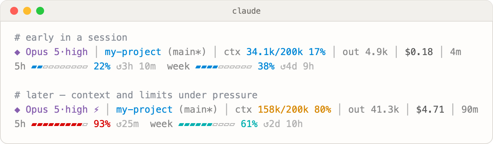

# claude-code-statusline

A single-file status line for [Claude Code](https://code.claude.com) that shows what
actually matters while you work: the model, remaining context window, session cost, and —
the part most status lines miss — your **subscription rate limits** (5-hour and weekly
windows) with time until reset.



No dependencies beyond the Python 3 that ships with macOS and most Linux distros.

## Remaining quota, not usage

Claude Code reports `used_percentage` — how much of a window has already been spent.
This script inverts that. Context and rate-limit bars **start full at 100%** and **drain
toward 0%** as you consume them. The number next to each bar is what is left.

Color still tracks pressure (how much has been spent): blue → teal → orange at 70% spent
→ red at 90% spent. A nearly empty bar is the warning, not a nearly full one.

## What it shows

**Line 1**

| Segment | Meaning |
| --- | --- |
| `◆ Opus 5·high` | Active model and effort level |
| `⚡` / `💤` | Fast mode on / extended thinking off |
| `my-project (main*)` | Current directory and git branch (`*` = uncommitted changes) |
| `ctx 48k/200k 24%` | Context **remaining**: tokens left, window size, remaining percent |
| `out 18.2k` | Output tokens generated this session |
| `$0.42` | Session cost |
| `7m` | Wall-clock session duration |

**Line 2 — rate limits**

Subscription plans report a 5-hour window (`5h`) and a weekly window (`week`), each with a
bar, a remaining percentage, and time until reset (`↺`). API/gateway accounts get a spend
limit (`spend`) instead. Before the first model response of a session the data isn't
available yet, and the line says so.

The palette is picked to stay readable on light terminals and to remain distinguishable
for colorblind users (it avoids relying on a red/green contrast).

## Install

```sh
curl -fsSL https://raw.githubusercontent.com/dench5566-ctrl/claude-code-statusline/main/statusline.py \
  -o ~/.claude/statusline.py
```

Then add this to `~/.claude/settings.json`:

```json
{
  "statusLine": {
    "type": "command",
    "command": "/usr/bin/python3 ~/.claude/statusline.py",
    "padding": 0,
    "refreshInterval": 10
  }
}
```

Restart `claude` if the line doesn't appear immediately.

On Linux, point the command at your interpreter (`python3` on `PATH` usually works);
on Windows use `python C:\Users\<you>\.claude\statusline.py`.

## Requirements

- Claude Code **2.1.x** or newer — earlier versions don't pass `context_window` or
  `rate_limits` to the status line, and those segments will silently be omitted.
- Python 3.8+
- A terminal with 256-color support

## How it works

Claude Code runs the status line command on every render and pipes a JSON payload to
stdin. The script reads that payload and prints two lines. The fields it uses:

```jsonc
{
  "model":          { "display_name": "Opus 5" },
  "effort":         { "level": "high" },
  "fast_mode":      false,
  "thinking":       { "enabled": true },
  "workspace":      { "current_dir": "/path/to/project" },
  "context_window": { "total_input_tokens": 0, "total_output_tokens": 0,
                      "context_window_size": 200000, "used_percentage": 0 },
  "cost":           { "total_cost_usd": 0.0, "total_duration_ms": 0 },
  "rate_limits":    { "five_hour":   { "used_percentage": 0, "resets_at": 0 },
                      "seven_day":   { "used_percentage": 0, "resets_at": 0 },
                      "spend_limit": { "used_percentage": 0, "resets_at": 0 } }
}
```

`used_percentage` is spent quota. The script displays `100 − used_percentage` as remaining.
Every field is optional in practice — a missing one drops its segment rather than
breaking the line, so the script degrades gracefully across versions and account types.

Git branch detection shells out to `git` with a 0.4s timeout and is skipped outside a
repository.

See also the Grok Build port: [grok-build-statusline](https://github.com/dench5566-ctrl/grok-build-statusline).

## Customizing

Everything worth tweaking sits at the top of the file:

- `LOCALE` — `"en"` (default) or `"ru"` for the labels and time units
- `LABELS` — the label table itself; add your own language as another entry
- `GREY`, `BLUE`, `TEAL`, `ORANGE`, `RED`, … — 256-color codes
- `heat()` — the spent-percentage thresholds where colors escalate (40 / 70 / 90)
- `bar(remaining_pct, used_pct, width=10)` — bar width and the `▰▱` characters
- The `ctx` / `out` prefixes and the segment order live in `main()`

## License

[0BSD](LICENSE) — provided as is, with no warranty and no liability, and no
attribution required. Copy it into your dotfiles and change whatever you like.
